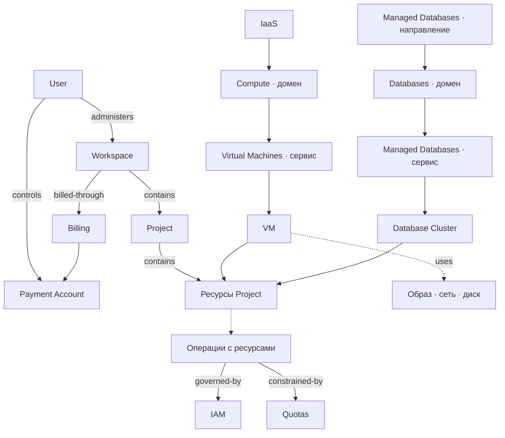

# Архитектура продукта

Документ показывает, как платформенные направления складываются из доменов, сервисов и ресурсов и какие правила действуют для них совместно. Это архитектура продукта, а не схема технического развёртывания.

Направление объединяет возможности для определённого круга задач. Домен определяет сущности, связи, операции и правила; внутри него сервис даёт пользователю конкретную возможность, а ресурс представляет управляемую сущность сервиса.



| Связь | Значение |
|---|---|
| `contains` / `belongs-to` | Workspace содержит проекты; каждый ресурс принадлежит одному Project и через него относится к Workspace. |
| `administers` / `controls` | Администрирование Workspace или управление Payment Account; не определяет юридического плательщика. |
| `uses` | Ресурс использует возможности или данные другого ресурса. |
| `governed-by` | Поведение регулируется политикой или правилами доступа. |
| `constrained-by` | Действие ограничено квотой, лимитом или совместимостью. |
| `billed-through` | Billing связывает потребление Workspace с действующим Payment Account и сохраняет историю этой связи. |

Workspace закреплён за администрирующим пользователем, содержит проекты и служит контекстом потребления. Каждый ресурс принадлежит одному Project; через него ресурс относится к Workspace независимо от платформенного направления. Project не имеет собственного плательщика или баланса.

Payment Account управляется пользователем и определяет плательщика — физическое или юридическое лицо. Один Payment Account может оплачивать несколько Workspace; сами эти сущности не вложены друг в друга.

Billing — отдельный домен между Workspace и Payment Account: он ведёт привязку, оценивает потребление и проводит расчёты. Workspace не хранит деньги в целевой модели. Правила предоплаты, постоплаты и передачи описаны в [документе биллинга](/docs/domains/billing).

Organization задаёт общие контексты, Billing — расчёты. Их правила, а также IAM и квоты применяются к сервисам разных направлений. Образ, сеть и диск показаны как связи VM с другими возможностями; их собственные границы сервисов и ресурсов ещё не определены здесь.

## Платформенные направления

Направления не образуют взаимоисключающее дерево: сервис может участвовать в нескольких предложениях платформы.

| Направление | Место в модели |
|---|---|
| **IaaS** | Классическая облачная инфраструктура: виртуальные машины, вычислительные образы, диски, сети и связанные ресурсы. |
| **Managed Kubernetes Platform (K8s)** | Управляемая платформа для кластеров Kubernetes и запуска нагрузок в них. Состав сервисов и границы ответственности требуют уточнения. |
| **Containers** | Возможности для работы с контейнерами. Их граница с Managed Kubernetes Platform и Serverless пока не определена. |
| **Managed Databases** | Управляемые базы данных. Могут входить в предложение IaaS и развиваться как самостоятельное платформенное направление с более широкими возможностями. |
| **AI Platform** | Возможности для AI-нагрузок; состав сервисов и связи с инфраструктурой пока не определены. |
| **Serverless** | Выполнение нагрузок без управления инфраструктурой на уровне виртуальных машин; конкретные продукты пока не определены. |

Managed Databases может предлагаться и внутри IaaS, и как самостоятельное направление. В обоих случаях это один сервис домена Databases с одной моделью Database Cluster.

## Партнёрская модель — гипотеза

Следующие сущности и отношения пока не входят в подтверждённое ядро архитектуры. Их смысл, полномочия и влияние на Workspace и Billing требуют продуктовой проверки.

```text
User ──represents?──→ Partner Account
Partner Account ──manages?──→ Client
Partner Account ──creates?──→ Deal
Deal ──applies-to?──→ Client / Workspace
Deal ──defines?──→ commercial conditions
```

`represents` означает действие от имени другого участника, `manages` — управление без предположения о юридическом владении, `creates` — действие, а не постоянную связь. `applies-to` задаёт область действия условий, `defines` — сами условия. Знаки вопроса на схеме показывают, что эти отношения ещё не подтверждены.
