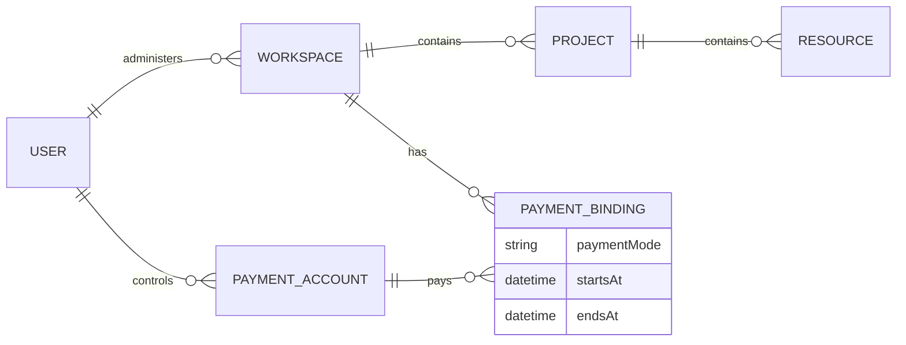

# Модель сущностей продукта

Это концептуальные сущности и кратности их связей, а не схема таблиц базы данных. Платформенные направления и сервисы показаны в [архитектуре продукта](/docs/product/architecture); здесь остаются общие контексты и связь с плательщиком.

У каждого Resource ровно один Project; Workspace определяется через него. Это правило едино для ресурсов разных сервисов. VM и Database Cluster — конкретные виды Resource, их поля и операции описываются в документах доменов.

Payment Binding обозначает платёжную привязку, описанную в [биллинге](/docs/domains/billing), а не отдельный баланс Workspace. История привязок сохраняется; во время платного потребления у Workspace действует ровно одна активная привязка к Payment Account. Режим оплаты и границы действия принадлежат этой связи.
